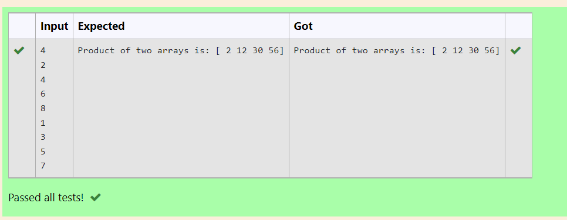

# Multiplying-two-matrix

## AIM:
 To write a python program to multiply two arrays using numpy.
## ALGORITHM:

### Step 1:
Importing numpy module.
### Step 2:
Get the input from user.
### Step 3:
Create a empty list l1 and l2.
### Step 4:
Use for loop to append the values into the list created.
### Step 5:
Print the product of two arrays .
## PROGRAM: 
```
import numpy as np

n=int(input())
l1,l2=[],[]
for i in range(n):
    l1.append(int(input()))
for i in range(n):
    l2.append(int(input()))
val1=np.array(l1)
val2=np.array(l2)
print("Product of two arrays is:",val1*val2)
```
## OUTPUT:

## RESULT:
A python program to multiply two arrays using numpy is written.
